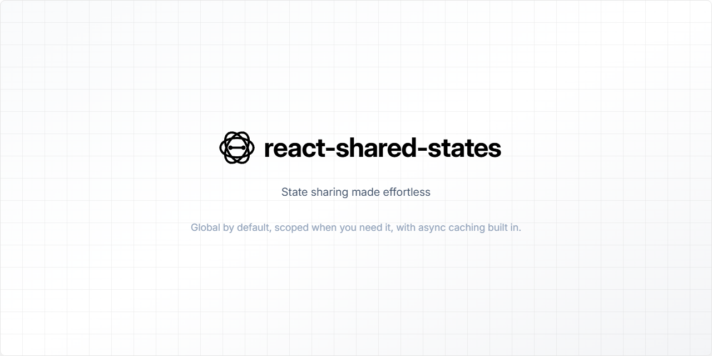

# React Shared States

**_Global state made as simple as useState, with zero config, built-in async caching, and automatic scoping._**



---

[](https://www.npmjs.com/package/react-shared-states)
[](https://bundlephobia.com/package/react-shared-states)
[](LICENSE)


Tiny, ergonomic, convention‑over‑configuration state, async function, and real-time subscription sharing for React. Global by default, trivially scoped when you need isolation, and opt‑in static APIs when you must touch state outside components. As simple as `useState`, as flexible as Zustand, without boilerplate like Redux.

## 🔥 Why this instead of Redux / Zustand / Context soup?
* 0 config. Just pick a key: `useSharedState('cart', [])`.
* Automatic scoping: nearest `SharedStatesProvider` wins; omit it for global.
* Cross‑tree sharing via named scopes (two providers with same `scopeName` share data) – powerful for portals/modals/micro‑frontends.
* Async functions become cached shared resources via `useSharedFunction` (built‑in loading, error, results, reentrancy guard, manual or forced refresh).
* Static APIs (`sharedStatesApi`, `sharedFunctionsApi`) let you prime / read / mutate outside React (SSR, event buses, dev tools, tests).
* No custom store objects, reducers, actions, selectors, immer, proxies, or serialization hoops.
* Predictable: key + scope ⇒ value. That’s it.


## 🚀 Install

```sh
npm install react-shared-states
```
or
```sh
pnpm add react-shared-states
```

## ☕ 60‑Second TL;DR
```tsx
import { useSharedState } from 'react-shared-states';

function A(){
  const [count, setCount] = useSharedState('counter', 0);
  return <button onClick={()=>setCount(c=>c+1)}>A {count}</button>;
}
function B(){
  const [count] = useSharedState('counter', 0);
  return <span>B sees {count}</span>;
}

function App() {
  
  return (
    <>
      <A/>
      <B/>
    </>
  )
}
```
Same key ⇒ same state (global scope by default).

Add a scope:
```tsx
import { SharedStatesProvider, useSharedState } from 'react-shared-states';

function Scoped(){
  const [count, set] = useSharedState('counter', 0); // isolated inside provider
  return <button onClick={()=>set(c=>c+1)}>Scoped {count}</button>;
}

function App() {

  return (
    <>
      <A/>
      <B/>
      <SharedStatesProvider>
        <Scoped/>
      </SharedStatesProvider>
    </>
  )
}
```

Override / jump to a named scope explicitly:
```tsx
useSharedState('counter', 0, 'modal'); // 3rd arg is scopeName override
```

Two separate trees with the same `SharedStatesProvider scopeName` share their data:
```tsx
<SharedStatesProvider scopeName="modal">
  <ModalContent/>
</SharedStatesProvider>
<Portal target={...}>
  <SharedStatesProvider scopeName="modal">
    <FloatingToolbar/>
  </SharedStatesProvider>
</Portal>
function App() {

  return (
    <>
      <SharedStatesProvider scopeName="modal">
        <ModalContent/>
      </SharedStatesProvider>
      <Portal target={...}>
        <SharedStatesProvider scopeName="modal">
          <FloatingToolbar/>
        </SharedStatesProvider>
      </Portal>
    </>
  )
}
```

Async shared function (one fetch, instant reuse when new component mounts):
```tsx
import { useEffect, useState } from 'react';
import { useSharedFunction } from 'react-shared-states';

// Any async callback you want to share
const fetchCurrentUser = () => fetch('/api/me').then(r => r.json());

function UserHeader(){
  const { state, trigger } = useSharedFunction('current-user', fetchCurrentUser);
  
  useEffect(() => {
    
    trigger();
    
  }, []);
  
  if(state.isLoading && !state.results) return <p>Loading user...</p>;
  
  if(state.error) return <p style={{color:'red'}}>Failed.</p>;
  
  return <h1>{state.results.name}</h1>;
}

function UserDetails(){
  const { state, trigger } = useSharedFunction('current-user', fetchCurrentUser);
  // This effect will run when the component appears later, but fetch is already cached so trigger does nothing.
  useEffect(() => {

    trigger();

  }, []);

  if(state.isLoading && !state.results) return <p>Loading user...</p>; // this will not happen, cuz we already have the shared result
  if(state.error) return <p style={{color:'red'}}>Failed.</p>; // this will not happen, cuz we already have the shared result
  
  return <pre>{JSON.stringify(state.results, null, 2)}</pre>;
}

export default function App(){
  const [showDetails, setShowDetails] = useState(false);
  return (
    <div>
      <UserHeader/>
      <button onClick={()=>setShowDetails(s=>!s)}>
        {showDetails ? 'Hide details' : 'Show details'}
      </button>
      {showDetails && <UserDetails/>}
    </div>
  );
}

// If you need to force a refetch somewhere:
// const { forceTrigger } = useSharedFunction('current-user', fetchCurrentUser);
// forceTrigger(); // bypass cache & re-run
```


## 🧠 Core Concepts
| Concept              | Summary                                                                                                                         |
|----------------------|---------------------------------------------------------------------------------------------------------------------------------|
| Global by default    | No provider necessary. Same key => shared state.                                                                                |
| Scoping              | Wrap with `SharedStatesProvider` to isolate. Nearest provider wins.                                                             |
| Named scopes         | `scopeName` prop lets distant providers sync (same name ⇒ same bucket). Unnamed providers auto‑generate a random isolated name. |
| Manual override      | Third param in `useSharedState` / `useSharedFunction` / `useSharedSubscription` enforces a specific scope ignoring tree search. |
| Shared functions     | Encapsulate async logic: single flight + cached result + `error` + `isLoading` + opt‑in refresh.                                |
| Shared subscriptions | Real-time data streams: automatic cleanup + shared connections + `error` + `isLoading` + subscription state.                    |
| Static APIs          | Access state/functions/subscriptions outside components (`sharedStatesApi`, `sharedFunctionsApi`, `sharedSubscriptionsApi`).    |


## 🏗️ Sharing State (`useSharedState`)
Signature: `const [value, setValue] = useSharedState(key, initialValue, scopeName?);`

Behavior:
* First hook call (per key + scope) seeds with `initialValue`.
* Subsequent mounts with same key+scope ignore their `initialValue` (consistent source of truth).
* Setter accepts either value or updater `(prev)=>next`.
* React batching + equality check: listeners fire only when the value reference actually changes.

### Examples
1. Global theme
    ```tsx
    const [theme, setTheme] = useSharedState('theme', 'light');
    ```
2. Isolated wizard progress
    ```tsx
    <SharedStatesProvider>
      <Wizard/>
    </SharedStatesProvider>
    ```
3. Forcing cross‑portal sync
    ```tsx
    <SharedStatesProvider scopeName="nav" children={<PrimaryNav/>} />
    <Portal>
      <SharedStatesProvider scopeName="nav" children={<MobileNav/>} />
    </Portal>
    ```
4. Overriding nearest provider
    ```tsx
    // Even if inside a provider, this explicitly binds to global
    const [flag, setFlag] = useSharedState('feature-x-enabled', false, '_global');
    ```


## ⚡ Shared Async Functions (`useSharedFunction`)
Signature:
```ts
const { state, trigger, forceTrigger, clear } = useSharedFunction(key, asyncFn, scopeName?);
```
`state` shape: `{ results?: T; isLoading: boolean; error?: unknown }`

Semantics:
* First `trigger()` (implicit or manual) runs the function; subsequent calls do nothing while loading or after success (cached) unless you `forceTrigger()`.
* Multiple components with the same key+scope share one execution + result.
* `clear()` deletes the cache (next trigger re-runs).
* You decide when to invoke `trigger` (e.g. on mount, on button click, when dependencies change, etc.).

### Pattern: lazy load on first render
```tsx
function Profile({id}:{id:string}){
  const { state, trigger } = useSharedFunction(`profile-${id}`, () => fetch(`/api/p/${id}`).then(r=>r.json()));
  
  if(!state.results && !state.isLoading) trigger();
  if(state.isLoading) return <p>Loading...</p>;
  return <pre>{JSON.stringify(state.results,null,2)}</pre>
}
```

### Pattern: always fetch fresh
```tsx
const { state, forceTrigger } = useSharedFunction('server-time', () => fetch('/time').then(r=>r.text()));
const refresh = () => forceTrigger();
```


## 📡 Real-time Subscriptions (`useSharedSubscription`)
Perfect for Firebase listeners, WebSocket connections,
Server-Sent Events, or any streaming data source that needs cleanup.

Signature:
```ts
const { state, trigger, unsubscribe } = useSharedSubscription(key, subscriber, scopeName?);
```

`state` shape: `{ data?: T; isLoading: boolean; error?: unknown; subscribed: boolean }`

The `subscriber` function receives three callbacks:
- `set(data)`: Update the shared data
- `onError(error)`: Handle errors 
- `onCompletion()`: Mark loading as complete
- Returns: Optional cleanup function (called on unsubscribe/unmount)

### Pattern: Firebase Firestore real-time listener
```tsx
import { useEffect } from 'react';
import { onSnapshot, doc } from 'firebase/firestore';
import { useSharedSubscription } from 'react-shared-states';
import { db } from './firebase-config'; // your Firebase config

function UserProfile({ userId }: { userId: string }) {
  const { state, trigger, unsubscribe } = useSharedSubscription(
    `user-${userId}`,
    async (set, onError, onCompletion) => {
      const userRef = doc(db, 'users', userId);
      
      // Set up the real-time listener
      const unsubscribe = onSnapshot(
        userRef,
        (snapshot) => {
          if (snapshot.exists()) {
            set({ id: snapshot.id, ...snapshot.data() });
          } else {
            set(null);
          }
        },
        onError,
        onCompletion
      );
      
      // Return cleanup function
      return unsubscribe;
    }
  );

  // Start listening when component mounts
  useEffect(() => {
    trigger();
  }, []);

  if (state.isLoading) return <div>Connecting...</div>;
  if (state.error) return <div>Error: {state.error.message}</div>;
  if (!state.data) return <div>User not found</div>;

  return (
    <div>
      <h1>{state.data.name}</h1>
      <p>{state.data.email}</p>
      <button onClick={unsubscribe}>Stop listening</button>
    </div>
  );
}
```

### Pattern: WebSocket connection
```tsx
import { useEffect } from 'react';
import { useSharedSubscription } from 'react-shared-states';

function ChatRoom({ roomId }: { roomId: string }) {
  const { state, trigger } = useSharedSubscription(
    `chat-${roomId}`,
    (set, onError, onCompletion) => {
      const ws = new WebSocket(`ws://chat-server/${roomId}`);
      
      ws.onopen = () => onCompletion();
      ws.onmessage = (event) => {
        const message = JSON.parse(event.data);
        set(prev => [...(prev || []), message]);
      };
      ws.onerror = onError;
      
      return () => ws.close();
    }
  );

  useEffect(() => {
    trigger();
  }, []);

  return (
    <div>
      {state.isLoading && <p>Connecting to chat...</p>}
      {state.error && <p>Connection failed</p>}
      <div>
        {state.data?.map(msg => (
          <div key={msg.id}>{msg.text}</div>
        ))}
      </div>
    </div>
  );
}
```

### Pattern: Server-Sent Events
```tsx
import { useEffect } from 'react';
import { useSharedSubscription } from 'react-shared-states';

function LiveUpdates() {
  const { state, trigger } = useSharedSubscription(
    'live-updates',
    (set, onError, onCompletion) => {
      const eventSource = new EventSource('/api/live-updates');
      
      eventSource.onopen = () => onCompletion();
      eventSource.onmessage = (event) => {
        set(JSON.parse(event.data));
      };
      eventSource.onerror = onError;
      
      return () => eventSource.close();
    }
  );

  useEffect(() => {
    trigger();
  }, []);

  return <div>Latest: {JSON.stringify(state.data)}</div>;
}
```

Subscription semantics:
* First `trigger()` establishes the subscription; subsequent calls do nothing if already subscribed.
* Multiple components with the same key+scope share one subscription + data stream.
* `unsubscribe()` closes the connection and clears the subscribed state.
* Automatic cleanup on component unmount when no other components are listening.
* Components mounting later instantly get the latest `data` without re-subscribing.


## 🛰️ Static APIs (outside React)
Useful for SSR hydration, event listeners, debugging, imperative workflows.

```ts
import { sharedStatesApi, sharedFunctionsApi, sharedSubscriptionsApi } from 'react-shared-states';

// Preload state (global scope by default)
sharedStatesApi.set('bootstrap-data', { user: {...} });

// Preload state in a named scope
sharedStatesApi.set('bootstrap-data', { user: {...} }, 'myScope');

// Read later
const user = sharedStatesApi.get('bootstrap-data'); // global
const userScoped = sharedStatesApi.get('bootstrap-data', 'myScope');

// Inspect all (returns nested object: { [scope]: { [key]: value } })
console.log(sharedStatesApi.getAll());

// Clear all keys in a scope
sharedStatesApi.clearScope('myScope');

// For shared functions
const fnState = sharedFunctionsApi.get('profile-123');
const fnStateScoped = sharedFunctionsApi.get('profile-123', 'myScope');

// For shared subscriptions
const subState = sharedSubscriptionsApi.get('live-chat');
const subStateScoped = sharedSubscriptionsApi.get('live-chat', 'myScope');
```

## API summary:

| API                      | Methods                                                                                                                                                   |
|--------------------------|-----------------------------------------------------------------------------------------------------------------------------------------------------------|
| `sharedStatesApi`        | `get(key, scopeName?)`, `set(key, val, scopeName?)`, `has(key, scopeName?)`, `clear(key, scopeName?)`, `clearAll()`, `clearScope(scopeName?)`, `getAll()` |
| `sharedFunctionsApi`     | `get(key, scopeName?)`, `set(key, val, scopeName?)`, `has(key, scopeName?)`, `clear(key, scopeName?)`, `clearAll()`, `clearScope(scopeName?)`, `getAll()` |
| `sharedSubscriptionsApi` | `get(key, scopeName?)`, `set(key, val, scopeName?)`, `has(key, scopeName?)`, `clear(key, scopeName?)`, `clearAll()`, `clearScope(scopeName?)`, `getAll()` |

`scopeName` defaults to `"_global"`. Internally, keys are stored as `${scope}//${key}`. The `.getAll()` method returns a nested object: `{ [scope]: { [key]: value } }`.


## 🧩 Scoping Rules Deep Dive
Resolution order used inside hooks:
1. Explicit 3rd parameter (`scopeName`)
2. Nearest `SharedStatesProvider` above the component
3. The implicit global scope (`_global`)

Unnamed providers auto‑generate a random scope name: each mount = isolated island.

Two providers sharing the same `scopeName` act as a single logical scope even if they are disjoint in the tree (great for portals / microfrontends).


## 🆚 Comparison Snapshot
| Criterion      | react-shared-states                      | Redux Toolkit        | Zustand                          |
|----------------|------------------------------------------|----------------------|----------------------------------|
| Setup          | Install & call hook                      | Slice + store config | Create store function            |
| Global state   | Yes (by key)                             | Yes                  | Yes                              |
| Scoped state   | Built-in (providers + names + overrides) | Needs custom logic   | Needs multiple stores / contexts |
| Async helper   | `useSharedFunction` (cache + status)     | Thunks / RTK Query   | Manual or middleware             |
| Boilerplate    | Near zero                                | Moderate             | Low                              |
| Static access  | Yes (APIs)                               | Yes (store)          | Yes (store)                      |
| Learning curve | Minutes                                  | Higher               | Low                              |


## 🧪 Testing Tips
* Use static APIs to assert state after component interactions.
* `sharedStatesApi.clearAll()`, `sharedFunctionsApi.clearAll()`, `sharedSubscriptionsApi.clearAll()` in `afterEach` to isolate tests.
* For async functions: trigger once, await UI stabilization, assert `results` present.
* For subscriptions: mock the subscription source (Firebase, WebSocket, etc.) and verify data flow.


## ❓ FAQ
**Q: How do I reset a single shared state?**  
`sharedStatesApi.clear('key')` or inside component: call a setter with the initial value.

**Q: Can I pre-hydrate data on the server?**  
Yes. Call `sharedStatesApi.set(...)` during bootstrap, then first client hook usage will pick it up.

**Q: How do I avoid accidental key collisions?**  
Prefix keys by domain (e.g. `user:profile`, `cart:items`) or rely on provider scoping.

**Q: Why is my async function not re-running?**  
It's cached. Use `forceTrigger()` or `clear()`.

**Q: How do I handle subscription cleanup?**  
Subscriptions auto-cleanup when no components are listening. You can also manually call `unsubscribe()`.

**Q: Can I use it with Suspense?**  
Currently no built-in Suspense wrappers; wrap `useSharedFunction` yourself if desired.


## 📚 Full API Reference
### `useSharedState(key, initialValue, scopeName?)`
Returns `[value, setValue]`.

### `useSharedFunction(key, fn, scopeName?)`
Returns `{ state, trigger, forceTrigger, clear }`.

### `useSharedSubscription(key, subscriber, scopeName?)`
Returns `{ state, trigger, unsubscribe }`.

### `<SharedStatesProvider scopeName?>`
Wrap children; optional `scopeName` (string). If omitted a random unique one is generated.

### Static
`sharedStatesApi`, `sharedFunctionsApi`, `sharedSubscriptionsApi` (see earlier table).


## 🤝 Contributions

We welcome contributions!
If you'd like to improve `react-shared-states`,
feel free to [open an issue](https://github.com/HichemTab-tech/react-shared-states/issues) or [submit a pull request](https://github.com/HichemTab-tech/react-shared-states/pulls).


## Author

- [@HichemTab-tech](https://www.github.com/HichemTab-tech)

## License

[MIT](https://github.com/HichemTab-tech/react-shared-states/blob/master/LICENSE)

## 🌟 Acknowledgements

Inspired by React's built-in primitives and the ergonomics of modern lightweight state libraries.
Thanks to early adopters for feedback.